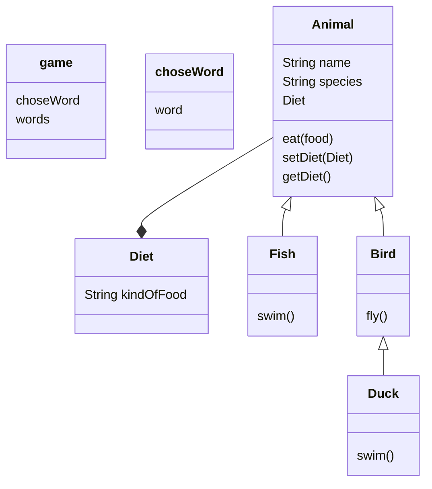

```mermaid
classDiagram

class game
game: choseWord
game: words

class choseWord
choseWord:word

class Animal
Animal : String name
Animal : String species
Animal : eat(food)
Animal : Diet
Animal : setDiet(Diet)
Animal : getDiet()

class Diet
Diet : String kindOfFood

Animal --* Diet

class Fish
Animal <|-- Fish
Fish : swim()


class Bird
Animal <|-- Bird
Bird : fly()

class Duck
Bird <|-- Duck
Duck : swim()

```